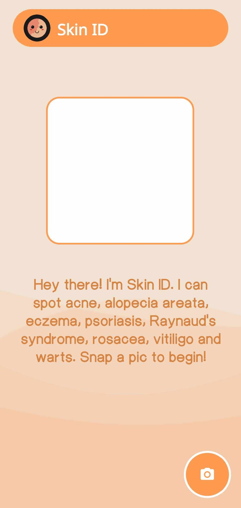

<!-- Improved compatibility of back to top link: See: https://github.com/othneildrew/Best-README-Template/pull/73 -->
<a name="readme-top"></a>
<!--
*** Thanks for checking out the Best-README-Template. If you have a suggestion
*** that would make this better, please fork the repo and create a pull request
*** or simply open an issue with the tag "enhancement".
*** Don't forget to give the project a star!
*** Thanks again! Now go create something AMAZING! :D
-->


<!-- PROJECT SHIELDS -->
<!--
*** I'm using markdown "reference style" links for readability.
*** Reference links are enclosed in brackets [ ] instead of parentheses ( ).
*** See the bottom of this document for the declaration of the reference variables
*** for contributors-url, forks-url, etc. This is an optional, concise syntax you may use.
*** https://www.markdownguide.org/basic-syntax/#reference-style-links
-->
[![Contributors][contributors-shield]][contributors-url]
[![Forks][forks-shield]][forks-url]
[![Stargazers][stars-shield]][stars-url]
[![Issues][issues-shield]][issues-url]

<!-- PROJECT LOGO -->
<br />
<div align="center">
  <a href="https://github.com/10sth01/skinid-app">
    
  </a>

<h3 align="center">Skin ID</h3>

  <p align="center">
    Skin ID is an Android application that utilizes artificial intelligence to detect and classify various skin lesions, including acne, alopecia areata, eczema, psoriasis, rosacea, vitiligo, and warts. While Skin ID performs well, there is ample room for improvement to enhance its accuracy and expand its range. Contributions are welcome to help the app grow and improve.
    <br />
    <br />
    ·
    <a href="https://github.com/10sth01/skinid-app/issues/new?labels=bug&template=bug-report---.md">Report Bug</a>
    ·
    <a href="https://github.com/10sth01/skinid-app/issues/new?labels=enhancement&template=feature-request---.md">Request Feature</a>
    ·
  </p>
</div>

<!-- TABLE OF CONTENTS -->
<details>
  <summary>Table of Contents</summary>
  <ol>
    <li>
      <a href="#about-the-project">About The Project</a>
      <ul>
        <li><a href="#built-with">Built With</a></li>
      </ul>
    </li>
    <li>
      <a href="#getting-started">Getting Started</a>
      <ul>
        <li><a href="#prerequisites">Prerequisites</a></li>
        <li><a href="#installation">Installation</a></li>
      </ul>
    </li>
    <li><a href="#usage">Usage</a></li>
    <li><a href="#contributing">Contributing</a></li>
    <li><a href="#license">License</a></li>
    <li><a href="#contact">Contact</a></li>
  </ol>
</details>

<!-- ABOUT THE PROJECT -->
## About The Project
<div align="center">
  
  
</div>
<p align="right">(<a href="#readme-top">back to top</a>)</p>

### Built With

* Kotlin
  
<p align="right">(<a href="#readme-top">back to top</a>)</p>

<!-- GETTING STARTED -->
## Getting Started

### Prerequisites

1. <b>Java Development Kit (JDK)</b>: Ensure you have JDK installed on your system. You can download it from <a href="https://www.oracle.com/java/technologies/downloads/#java11">here.</a>
2. <b>Android Studio</b>: Download and install Android Studio from <a href="https://developer.android.com/studio">here.</a>
3. <b>Git</b>: Install Git for version control from <a href="[https://developer.android.com/studio](https://git-scm.com/downloads)">here.</a>

### Installation

1. <b>Clone the GitHub Repository:</b>
  * Open a terminal (Command Prompt, Git Bash, or terminal in Android Studio).
  * Navigate to the directory where you want to clone the project.
  * Run the following command:
    ```sh
    git clone https://github.com/username/repository-name.git
    ```
2. <b>Open the Project in Android Studio:</b>
  * Launch Android Studio
  * Click on <b>'File' > 'Open'</b>.
  * Navigate to the cloned repository directory and click 'OK'.
  * Android Studio will open the project and start building it. This may take some time depending on your system and the project size.
3. <b>Sync Project with Gradle Files:</b>
  * If not automatically prompted, go to <b>'File' > 'Sync Project with Gradle Files'</b> to ensure all dependencies are downloaded and configured correctly.
4. <b>Configure the Android Virtual Device (AVD):</b>
  * Go to <b>'Tools' > 'AVD Manager'</b>.
  * Click on <b>'Create Virtual Device'</b>.
  * Choose a device definition and click <b>'Next'</b>.
  * Select a system image (e.g., the latest stable version) and click <b>'Next'</b>.
  * Verify the configuration and click <b>'Finish'</b>.
5. <b>Build and Run the Application</b>
  * Ensure your preferred AVD is selected.
  * Click the green <b>'Run'</b> button (▶) in the Android Studio toolbar.
  * The application will build and deploy to the selected AVD.
6. <b>Resolve Any Issues:</b>
  * If there are any build errors or missing dependencies, Android Studio will display messages in the <b>'Build'</b> tab at the bottom. Follow the instructions to resolve these issues.

### Additional Tips:
* <b>Update Dependencies:</b> Occasionally, you might need to update the Gradle plugin or dependencies. Go to <b>'File' > 'Project Structure' > 'Project'</b> to check and update versions.
* <b>Version Control:</b> To keep your local copy updated with changes from Github, regularly pull updates.
* ```sh
  git pull origin main
  ```
  Replace <b>'main'</b> with the branch you are working on if it is different.

### Troubleshooting:
* <b>Gradle Sync Issues:</b> If you encounter issues during Gradle sync, try <b>'File' > 'Invalidate Cahces / Restart'</b>.
* <b>Emulator Issues:</b> If the emulator fails to start, try <b>'Tools' > 'AVD Manager' > 'Cold Boot Now'</b> on the selected device.

<p align="right">(<a href="#readme-top">back to top</a>)</p>

<!-- USAGE EXAMPLES -->
## Usage


<p align="right">(<a href="#readme-top">back to top</a>)</p>

<!-- CONTRIBUTING -->
## Contributing

Contributions are what make the open source community such an amazing place to learn, inspire, and create. Any contributions you make are **greatly appreciated**.

If you have a suggestion that would make this better, please fork the repo and create a pull request. You can also simply open an issue with the tag "enhancement".
Don't forget to give the project a star! Thanks again!

1. Fork the Project
2. Create your Feature Branch (`git checkout -b feature/AmazingFeature`)
3. Commit your Changes (`git commit -m 'Add some AmazingFeature'`)
4. Push to the Branch (`git push origin feature/AmazingFeature`)
5. Open a Pull Request

<p align="right">(<a href="#readme-top">back to top</a>)</p>

<!-- LICENSE -->
## License

Distributed under the MIT License. See `LICENSE.txt` for more information.

<p align="right">(<a href="#readme-top">back to top</a>)</p>

<!-- CONTACT -->
## Contact

* Samantha Sampot - sampotsamantha@gmail.com
* Francheska Christine Mojica - cheskacmojica@gmail.com
* Lalaine Joy Bejarin - blc0385@dlsud.edu.ph

Project Link: [https://github.com/10sth01/skinid-app](https://github.com/10sth01/skinid-app)

<p align="right">(<a href="#readme-top">back to top</a>)</p>

<!-- MARKDOWN LINKS & IMAGES -->
<!-- https://www.markdownguide.org/basic-syntax/#reference-style-links -->
[contributors-shield]: https://img.shields.io/github/contributors/10sth01/skinid-app.svg?style=for-the-badge
[contributors-url]: https://github.com/10sth01/skinid-app/graphs/contributors
[forks-shield]: https://img.shields.io/github/forks/10sth01/skinid-app.svg?style=for-the-badge
[forks-url]: https://github.com/10sth01/skinid-app/network/members
[stars-shield]: https://img.shields.io/github/stars/10sth01/skinid-app.svg?style=for-the-badge
[stars-url]: https://github.com/10sth01/skinid-app/stargazers
[issues-shield]: https://img.shields.io/github/issues/10sth01/skinid-app.svg?style=for-the-badge
[issues-url]: https://github.com/10sth01/skinid-app/issues

